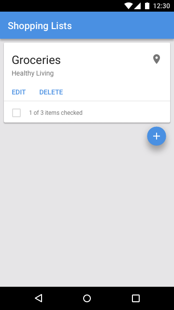
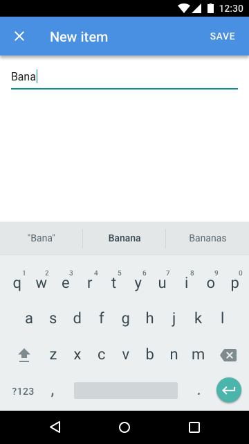

# Shopping List

**Note:** This is a work in progress.

&nbsp;&nbsp;&nbsp;&nbsp;&nbsp;&nbsp;&nbsp;&nbsp;&nbsp;&nbsp;&nbsp;&nbsp;&nbsp;&nbsp;&nbsp;&nbsp;

Shopping List is a series of Offline First demo apps, each built using a different stack. These demo apps cover Progressive Web Apps, hybrid mobile apps, native mobile apps, and desktop apps.

## Table of Contents

<!-- START doctoc generated TOC please keep comment here to allow auto update -->
<!-- DON'T EDIT THIS SECTION, INSTEAD RE-RUN doctoc TO UPDATE -->


- [Purposes](#purposes)
- [Features](#features)
- [Implementations](#implementations)
  - [Vanilla JS and PouchDB](#vanilla-js-and-pouchdb)
  - [Polymer and PouchDB](#polymer-and-pouchdb)
  - [React and PouchDB](#react-and-pouchdb)
  - [Preact and PouchDB](#preact-and-pouchdb)
  - [Vue.js and PouchDB](#vuejs-and-pouchdb)
  - [Ember.js and PouchDB](#emberjs-and-pouchdb)
  - [React Native and PouchDB](#react-native-and-pouchdb)
  - [React Native and Cloudant Sync](#react-native-and-cloudant-sync)
  - [Ionic and PouchDB](#ionic-and-pouchdb)
  - [Ionic and Cloudant Sync](#ionic-and-cloudant-sync)
  - [Cordova and PouchDB](#cordova-and-pouchdb)
  - [Cordova and Cloudant Sync](#cordova-and-cloudant-sync)
  - [Swift and Cloudant Sync](#swift-and-cloudant-sync)
  - [Kotlin and Cloudant Sync](#kotlin-and-cloudant-sync)
  - [Electron and PouchDB](#electron-and-pouchdb)
- [Interoperability](#interoperability)
  - [Shopping List Example](#shopping-list-example)
  - [Shopping List Item Example](#shopping-list-item-example)
  - [Geolocation Context Example](#geolocation-context-example)
- [Domain Model Implementations](#domain-model-implementations)
  - [JavaScript](#javascript)
  - [Swift](#swift)
  - [Kotlin](#kotlin)
- [Style Guides](#style-guides)
- [Templates](#templates)

<!-- END doctoc generated TOC please keep comment here to allow auto update -->

## Purposes

These demo apps will each serve multiple purposes:

* Reference Implementations
* Live Demos
* Tutorials
* Workshops
* [Developer Journeys](https://developer.ibm.com/code/journey/)

## Features

Shopping List is a simple demo app, with a limited feature set. Here is a list of features written as user stories grouped by Epic:

* Planning
  * As a \<person planning to shop for groceries\>, I want to \<create a shopping list\> so that \<I can add items to this shopping list\>.
  * As a \<person planning to shop for groceries\>, I want to \<add an item to my shopping list\> so that \<I can remember to buy that item when I am at the grocery store later\>.
  * As a \<person planning to shop for groceries\>, I want to \<remove an item from my shopping list\> so that \<I can change my mind on what to buy when I am at the grocery store later\>.
* Shopping
  * As a \<person shopping for groceries\>, I want to \<view items on my shopping list\> so that \<I can remember what items to buy\>.
  * As a \<person shopping for groceries\>, I want to \<add an item to my shopping list\> so that \<I can remember to buy that item\>.
  * As a \<person shopping for groceries\>, I want to \<remove an item from my shopping list\> so that \<I can change my mind on what to buy\>.
  * As a \<person shopping for groceries\>, I want to \<check off an item on my shopping list\> so that \<I can keep track of what items I have bought\>.
* Offline First
  * As a \<person shopping for groceries\>, I want to \<have the app installed on my device\> so that \<I can continue to utilize my shopping list when no internet connection is available\>.
  * As a \<person shopping for groceries\>, I want to \<have my shopping list stored locally on my device\> so that \<I can continue to utilize my shopping list when no internet connection is available\>.
  * As a \<person shopping for groceries\>, I want to \<sync my shopping list with the cloud\> so that \<I can manage and utilize my shopping list on multiple devices\>.
* Multi-User / Multi-Device
  * As a \<new user\>, I want to \<sign up for the app\> so that \<I can use the app\>.
  * As an \<existing user\>, I want to \<sign in to the app\> so that \<I can use the app\>.
  * As an \<existing user\>, I want to \<sign out of the app\> so that \<I can protect my privacy\>.
* Geolocation
  * As a \<person planning to shop for groceries\>, I want to \<associate a shopping list with a grocery store\> so that \<I can be notified of this shopping list when I am physically at that grocery store\>.
  * As a \<person associating a shopping list with a physical store\>, I want to \<access previously-used locations\> so that \<I can quickly find the physical store for which I am searching\>.
  * As a \<person shopping for groceries\>, I want to \<be notified of a shopping list when I am physically at the grocery store associated with that shopping list\> so that \<I can quickly find the shopping list for my current context\>.

## Implementations

### Vanilla JS and PouchDB

&nbsp;&nbsp;&nbsp;&nbsp;&nbsp;&nbsp;&nbsp;&nbsp;

GitHub Repository:  
https://github.com/ibm-watson-data-lab/shopping-list-vanillajs-pouchdb

### Polymer and PouchDB

&nbsp;&nbsp;&nbsp;&nbsp;&nbsp;&nbsp;&nbsp;&nbsp;&nbsp;&nbsp;&nbsp;&nbsp;&nbsp;&nbsp;&nbsp;&nbsp;

GitHub Repository:  
https://github.com/ibm-watson-data-lab/shopping-list-polymer-pouchdb

### React and PouchDB

&nbsp;&nbsp;&nbsp;&nbsp;&nbsp;&nbsp;&nbsp;&nbsp;&nbsp;&nbsp;&nbsp;&nbsp;&nbsp;&nbsp;&nbsp;&nbsp;

GitHub Repository:  
https://github.com/ibm-watson-data-lab/shopping-list-react-pouchdb

### Preact and PouchDB

&nbsp;&nbsp;&nbsp;&nbsp;&nbsp;&nbsp;&nbsp;&nbsp;&nbsp;&nbsp;&nbsp;&nbsp;&nbsp;&nbsp;&nbsp;&nbsp;

GitHub Repository:  
https://github.com/ibm-watson-data-lab/shopping-list-preact-pouchdb

### Vue.js and PouchDB

&nbsp;&nbsp;&nbsp;&nbsp;&nbsp;&nbsp;&nbsp;&nbsp;&nbsp;&nbsp;&nbsp;&nbsp;&nbsp;&nbsp;&nbsp;&nbsp;

GitHub Repository:  
https://github.com/ibm-watson-data-lab/shopping-list-vuejs-pouchdb

### Ember.js and PouchDB

&nbsp;&nbsp;&nbsp;&nbsp;&nbsp;&nbsp;&nbsp;&nbsp;&nbsp;&nbsp;&nbsp;&nbsp;&nbsp;&nbsp;&nbsp;&nbsp;

GitHub Repository:  
https://github.com/ibm-watson-data-lab/shopping-list-emberjs-pouchdb

### React Native and PouchDB

&nbsp;&nbsp;&nbsp;&nbsp;&nbsp;&nbsp;&nbsp;&nbsp;

GitHub Repository:  
https://github.com/ibm-watson-data-lab/shopping-list-react-native-pouchdb

### React Native and Cloudant Sync

&nbsp;&nbsp;&nbsp;&nbsp;&nbsp;&nbsp;&nbsp;&nbsp;

GitHub Repository:  
https://github.com/ibm-watson-data-lab/shopping-list-react-native-cloudant-sync

### Ionic and PouchDB

&nbsp;&nbsp;&nbsp;&nbsp;&nbsp;&nbsp;&nbsp;&nbsp;

GitHub Repository:  
https://github.com/ibm-watson-data-lab/shopping-list-ionic-pouchdb

### Ionic and Cloudant Sync

&nbsp;&nbsp;&nbsp;&nbsp;&nbsp;&nbsp;&nbsp;&nbsp;

GitHub Repository:  
https://github.com/ibm-watson-data-lab/shopping-list-ionic-cloudant-sync

### Cordova and PouchDB

&nbsp;&nbsp;&nbsp;&nbsp;&nbsp;&nbsp;&nbsp;&nbsp;

GitHub Repository:  
https://github.com/ibm-watson-data-lab/shopping-list-cordova-pouchdb

### Cordova and Cloudant Sync

&nbsp;&nbsp;&nbsp;&nbsp;&nbsp;&nbsp;&nbsp;&nbsp;

GitHub Repository:  
https://github.com/ibm-watson-data-lab/shopping-list-cordova-cloudant-sync

### Swift and Cloudant Sync

&nbsp;&nbsp;&nbsp;&nbsp;&nbsp;&nbsp;&nbsp;&nbsp;

GitHub Repository:  
https://github.com/ibm-watson-data-lab/shopping-list-swift-cloudant-sync

### Kotlin and Cloudant Sync

&nbsp;&nbsp;&nbsp;&nbsp;&nbsp;&nbsp;&nbsp;&nbsp;

GitHub Repository:  
https://github.com/ibm-watson-data-lab/shopping-list-kotlin-cloudant-sync

### Electron and PouchDB

&nbsp;&nbsp;&nbsp;&nbsp;&nbsp;&nbsp;&nbsp;&nbsp;

GitHub Repository:  
https://github.com/ibm-watson-data-lab/shopping-list-electron-pouchdb

## Interoperability

Implementations of the Shopping List demo app share a data model. This allows the demo apps to be interoperable with one another. For example, a user could plan a shopping trip with a desktop app built using Electron and PouchDB. The same user could then use a native app built using Kotlin and Cloudant Sync while shopping for groceries. Much of the design of this data model is inspired by the [CouchDB Best Practices](https://ehealthafrica.github.io/couchdb-best-practices/) collection from eHealth Africa.

### Shopping List Example

```javascript
{
  "_id": "list:cj6mj1zfj000001n1ugjfkj33",
  "type": "list",
  "version": 1,
  "title": "Groceries",
  "checked": false,
  "place": {
    "title": "Healthy Living",
    "license": "Data © OpenStreetMap contributors, ODbL 1.0. http://www.openstreetmap.org/copyright",
    "lat": "44.46282415",
    "lon": "-73.1799710198028",
    "address": {
      "supermarket": "Healthy Living",
      "road": "Dorset Street",
      "city": "South Burlington",
      "county": "Chittenden County",
      "state": "Vermont",
      "postcode": "05406",
      "country": "United States of America",
      "countryCode": "us"
    }
  },
  "createdAt": "2017-08-21T18:40:00.000Z",
  "updatedAt": "2017-08-21T18:40:00.000Z"
}
```

Notes:

* `_id`: Unique identifier for the document. Generated from the following values, separated by colons:
  * Document type (`list`).
  * [Collision-resistant ID (cuid)](https://usecuid.org/).
* `type`: Document type (will always have a value of `list` for a shopping list).
* `version`: Document schema version.
* `title`: User-generated title for the shopping list.
* `checked`: Has this shopping list been fully checked off?
* `place`: Associates the shopping list with a geolocation. Derived from OpenStreetMap's [Nominatim](http://wiki.openstreetmap.org/wiki/Nominatim) search tool. The example above is derived from the following search:  
```
http://nominatim.openstreetmap.org/search/Healthy%20Living%20Vermont?format=json&addressdetails=1&namedetails=1
```
* `createdAt`: Date and time at which the document was created. Expressed as a simplified extended ISO format in zero UTC offset (which can be generated in JavaScript with `new Date().toISOString()`).
* `updatedAt`: Date and time at which the document was last updated. Expressed as a simplified extended ISO format in zero UTC offset.

### Shopping List Item Example

```javascript
{
  "_id": "list:cj6mj1zfj000001n1ugjfkj33:item:cj6mn7e36000001p9n14fgk6s",
  "type": "item",
  "version": 1,
  "title": "Mangos",
  "checked": false,
  "createdAt": "2017-08-21T18:43:00.000Z",
  "updatedAt": "2017-08-21T18:43:00.000Z"
}
```

Notes:

* `_id`: Unique identifier for the document. Generated from the following values, separated by colons:
  * Parent document type (`list`).
  * [Collision-resistant ID (cuid)](https://usecuid.org/) of the parent document.
  * Document type (`item`).
  * [Collision-resistant ID (cuid)](https://usecuid.org/).
* `type`: Document type (will always have a value of `item` for a shopping list item).
* `version`: Document schema version.
* `title`: User-generated title for the shopping list item.
* `checked`: Has this shopping list item been checked off?
* `createdAt`: Date and time at which the document was created. Expressed as a simplified extended ISO format in zero UTC offset (which can be generated in JavaScript with `new Date().toISOString()`).
* `updatedAt`: Date and time at which the document was last updated. Expressed as a simplified extended ISO format in zero UTC offset.

Here is an example of a [Mango](http://docs.couchdb.org/en/2.1.0/api/database/find.html) / [`pouchdb-find`](https://pouchdb.com/guides/mango-queries.html) / [Cloudant Query](https://console.bluemix.net/docs/services/Cloudant/api/cloudant_query.html) selector that utilizes the built-in `_all_docs` view to query a shopping list and all of its list items together:

```javascript
{
  "selector": {
    "_id": {
      "$gte": "list:cj6mj1zfj000001n1ugjfkj33",
      "$lte": "list:cj6mj1zfj000001n1ugjfkj33:\uffff"
    }
  }
}
```

Note that the above query can also be used to get a count of items within a shopping list by simply using the `Array.length` property (or equivalent) and accounting for the shopping list document being included in the results. Since PouchDB just runs every reduce function in memory, there is no benefit to using a `_count` reduce function when using PouchDB. The Cloudant Sync libraries for iOS and Android do not support map/reduce (but do support Cloudant Query / Mango).

### Geolocation Context Example

A geolocation context is used to notify the user when the geolocation capability of their device has indicated that they are near a place associated with a shopping list. This provides the user with quick access to the shopping list for their current geographic context.

```javascript
{
  "_id": "geo:drguywpyxp4t:list:cj6mj1zfj000001n1ugjfkj33",
  "type": "geo",
  "version": 1,
  "notified": false,
  "createdAt": "2017-08-21T18:57:00.000Z",
  "updatedAt": "2017-08-21T18:57:00.000Z"
}
```

Notes:

* `_id`: Unique identifier for the document. Generated from the following values, separated by colons:
  * Document type (`geo`).
  * Geohash of the `place.lat` and `place.lon` values from the associated shopping list at a precision of 12 (which can be generated in JavaScript using the [`latlon-geohash`](https://www.npmjs.com/package/latlon-geohash) module).
  * Shopping list document type (`list`).
  * [Collision-resistant ID (cuid)](https://usecuid.org/) of the associated shopping list document.
* `type`: Document type (will always have a value of `geo` for a geolocation context item).
* `version`: Document schema version.
* `notified`: Has a notification already been sent for this geolocation context? Note that the geolocation context document may be deleted after a notification has been sent and the corresponding shopping list has been fully checked off.
* `createdAt`: Date and time at which the document was created. Expressed as a simplified extended ISO format in zero UTC offset (which can be generated in JavaScript with `new Date().toISOString()`).
* `updatedAt`: Date and time at which the document was last updated. Expressed as a simplified extended ISO format in zero UTC offset.

Here is an example of a [Mango](http://docs.couchdb.org/en/2.1.0/api/database/find.html) / [`pouchdb-find`](https://pouchdb.com/guides/mango-queries.html) / [Cloudant Query](https://console.bluemix.net/docs/services/Cloudant/api/cloudant_query.html) selector that utilizes the built-in `_all_docs` view to query for geolocation contexts near the current geolocation coordinates of the device (the value `drguyw` below is the geohash of the user's location at a precision of 6, or ±0.61 km):

```javascript
{
  "selector": {
    "_id": {
      "$gte": "geo:drguyw",
      "$lte": "geo:drguyw\uffff"
    }
  }
}
```

## Domain Model Implementations

### JavaScript

GitHub Repository:  
https://github.com/ibm-watson-data-lab/shopping-list-model-js

### Swift

GitHub Repository:  
https://github.com/ibm-watson-data-lab/shopping-list-model-swift

### Kotlin

GitHub Repository:  
https://github.com/ibm-watson-data-lab/shopping-list-model-kotlin

## Style Guides

General guidelines:

* Where possible, a consistent style is maintained between the different demo app implementations.
* Where there is a style that is common for a particular type of application we defer to that style.

Implementations:

* **Vanilla JS:** [Bootstrap](http://getbootstrap.com/)
* **Polymer:** Material Design (using [Polymer App Toolbox](https://www.polymer-project.org/2.0/toolbox/))
* **React:** Material Design (using [Material-UI](http://www.material-ui.com/))
* **Preact:** Material Design (using [preact-material-components](https://github.com/prateekbh/preact-material-components))
* **Vue.js:** Material Design (using [Vuetify](https://vuetifyjs.com/))
* **Ember.js:** [Bootstrap](http://getbootstrap.com/)
* **React Native:** iOS Design Themes or Material Design (depending on the target platform)
* **Ionic:** iOS Design Themes or Material Design (depending on the target platform)
* **Cordova:** iOS Design Themes or Material Design (depending on the target platform)
* **Swift:** iOS Design Themes
* **Kotlin:** Material Design
* **Electron:** [Photon](http://photonkit.com/)

## Templates

See the `templates` directory for templates that can be used for each demo app implementation. This includes the following files:

* `LICENSE`
* `README.md`
